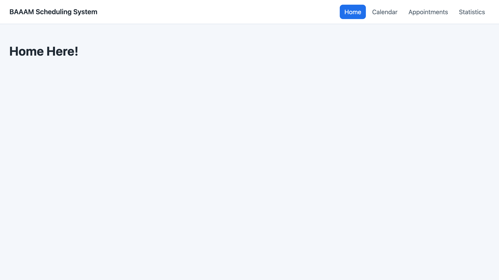
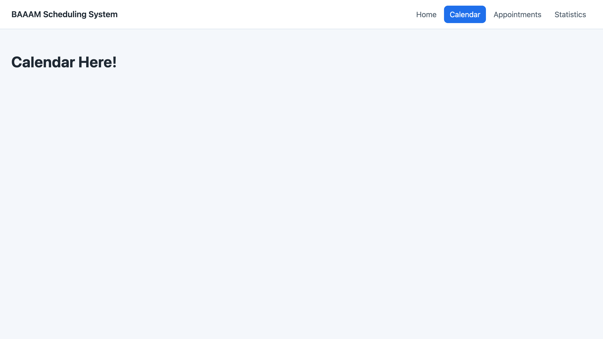
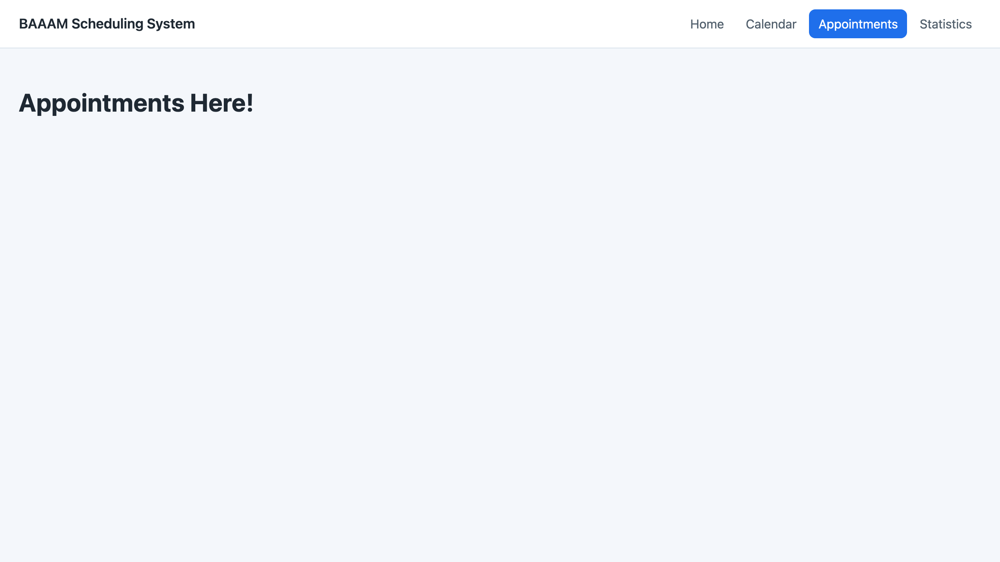
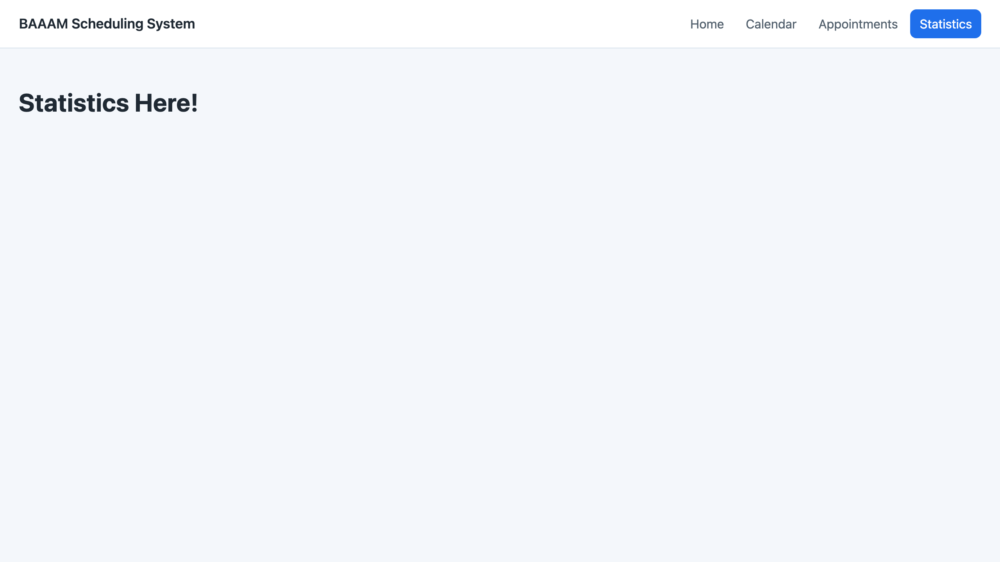

# Skeleton improvements: working API + Angular app shell, routing, and dev tooling

<!--
  This file is the pull-request body for the branch BAAAM/Angular_Skeleton.
  Copy everything below into the PR description on GitHub, or link reviewers to this file.
  Screenshots live next to this file in ./screenshots and are linked relatively below.
-->

## Jira ticket

<!-- TODO: paste the ticket URL for the Angular skeleton ticket. -->

https://baaa.atlassian.net/browse/BAAAM-XX

## Description

Replaces the empty `src/` and `tests/` placeholders with a **runnable end-to-end skeleton**: an
ASP.NET Core 9 Web API, an Angular 19 single-page app, the glue between them, and the tooling to
start both with one command.

Nothing here is the product yet — every page is still a `<h1>… Here!</h1>` placeholder. The point is
that the *frame* is real and verified, so the tickets that follow (calendar, appointments,
statistics, notifications, auth) each have an obvious place to land instead of all of us editing the
same two scaffold files at once.

### What landed

| Area | What this PR adds | Where |
| --- | --- | --- |
| Backend API | `GET /api/health` liveness endpoint returning `{ status, service, timestamp }` | `src/backend/AppointmentScheduler.Api` |
| Backend config | CORS origins read from `Cors:AllowedOrigins`; OpenAPI mapped in Development only | `Program.cs`, `appsettings.json` |
| Solution | `AppointmentScheduler.sln` tying the API to its test project | `src/backend` |
| Frontend shell | Top bar with brand + 4 nav links, `<router-outlet />`, active-link highlighting | `src/frontend/src/app/app.component.*` |
| Frontend routing | 4 lazily loaded page routes, a page title per route, `**` redirect to home | `src/frontend/src/app/app.routes.ts` |
| Frontend plumbing | `HealthService` + `HealthStatus` model as the template for future API calls | `src/frontend/src/app/core` |
| Frontend styles | Global design tokens (`--color-brand`, `--radius`, …), minimal reset, page colours | `src/frontend/src/styles.css` |
| Dev tooling | `./scripts/dev.sh` runs API + dev server and tears both down on Ctrl+C | `scripts/dev.sh` |
| Editor/toolchain | VS Code tasks (`dev: full stack`, `api: test`, `web: test`, …), SDK/Node pins | `.vscode/`, `global.json`, `.nvmrc` |
| Docs | README rewritten around the real layout, prerequisites, and run/test commands | `README.md` |
| Tests | 2 xUnit controller tests, 16 Karma specs (shell, layout, pages, service) | `tests/backend`, `src/frontend/src/**/*.spec.ts` |

### Backend

- `HealthController` has **no dependencies on purpose**, so it keeps answering `ok` even before
  MongoDB is wired up — it is a liveness check, not a readiness check.
- The response is a `record`, which gives us value equality in tests for free.
- The API listens on `http://localhost:5100` (see `Properties/launchSettings.json`).

### Frontend

- **Standalone components everywhere** — no `NgModule` boilerplate. `app.config.ts` is the single
  place for app-wide providers, so an auth interceptor later means one added line, not a new module.
- **Lazy routes**: the initial bundle contains only the shell plus home; calendar/appointments/
  statistics are separate chunks. Verified in the build output below.
- **Relative `/api` URLs**: `HealthService` calls `/api/health`, not `http://localhost:5100/api/health`.
  In development the Angular dev server proxies `/api` to the API (`proxy.conf.json`); in production
  the SPA and API are served from one origin. No environment files, no per-machine URLs.
- **Page titles per route** (`title:` on each route) so browser history and tabs are meaningful.

### Runtime evidence

Build output from `npm start` (initial total under 100 kB, one lazy chunk per page):

```text
Initial chunk files | Names     |  Raw size
polyfills.js        | polyfills |  89.77 kB
main.js             | main      |   7.71 kB
styles.css          | styles    | 555 bytes
                    | Initial total | 98.03 kB

Lazy chunk files            | Names                  |  Raw size
chunk-PHSWA7K3.js           | appointments-component |   2.51 kB
chunk-KZIFQCVP.js           | statistics-component   |   2.44 kB
chunk-S5S5OAEW.js           | calendar-component     |   2.38 kB
chunk-4MRYZ774.js           | home-component         |   2.25 kB
```

The proxy path is what the UI will actually use, so both were checked:

```console
$ curl -s http://localhost:4200/api/health      # through the ng serve proxy
{"status":"ok","service":"AppointmentScheduler.Api","timestamp":"2026-09-24T05:09:04.314414+00:00"}

$ curl -s http://localhost:5100/api/health      # direct to the API
{"status":"ok","service":"AppointmentScheduler.Api","timestamp":"2026-09-24T05:09:04.329243+00:00"}
```

## Acceptance criteria

- [x] `./scripts/dev.sh` starts the API on `http://localhost:5100` and the SPA on `http://localhost:4200`, and stops both on Ctrl+C
- [x] `GET /api/health` returns `status: "ok"` both directly and through the dev-server proxy
- [x] All four nav links route to their page and the active link is highlighted
- [x] Each route sets its own document title; an unknown URL falls back to home instead of a blank screen
- [x] `dotnet test` and `npm test` both pass
- [x] Node/.NET versions are pinned so a teammate can reproduce the setup from a fresh clone
- [x] Pages remain obvious placeholders that later tickets replace

## Tests added

- [x] Unit
- [ ] Integration
- [ ] End-to-end (e2e)
- [x] Manual / exploratory
- [ ] None (explain in Notes if so)

Unit tests: **16 Karma specs** on the frontend and **2 xUnit tests** on the backend, all passing.

```console
$ cd src/frontend && npm test -- --watch=false --browsers=ChromeHeadless
Chrome Headless 153.0.0.0 (Mac OS 10.15.7): Executed 16 of 16 SUCCESS (0.067 secs / 0.059 secs)
TOTAL: 16 SUCCESS

$ dotnet test src/backend/AppointmentScheduler.sln
Passed!  - Failed: 0, Passed: 2, Skipped: 0, Total: 2, Duration: 10 ms - AppointmentScheduler.Api.Tests.dll (net9.0)
```

What the specs cover

- `app.component.spec.ts` (5): the shell creates, exposes `title`, renders the brand in `.app-brand`,
  renders exactly one `.app-nav__link` per destination **in order**, and contains a `router-outlet`.
- `core/services/health.service.spec.ts` (3): `getHealth()` issues `GET /api/health` and emits the
  parsed body, and surfaces a failure when the API is unreachable — all via `HttpTestingController`,
  so no backend is needed.
- Each page spec (2 × 4 pages): the page constructs and renders its placeholder text (for example
  `Home Here!`). These are meant to be rewritten with the real page.
- `HealthControllerTests` (2, C#): the endpoint returns `Ok` with `status: "ok"` and the service
  name, and the timestamp is UTC and current.

Total: 5 + 3 + 8 = 16 frontend specs and 2 backend tests.

## Screenshots (optional)

Captured from a local run of this branch (`./scripts/dev.sh`, headless Chrome at 1280×720 @2×).
Every page below is intentionally a placeholder — what to look at is the **shell, the nav, and the
active-link state**, which is the part this PR actually builds.

| Route | Screenshot |
| --- | --- |
| `/` — Home |  |
| `/calendar` |  |
| `/appointments` |  |
| `/statistics` |  |

The header, brand, and nav are identical on all four screens because they live in `AppComponent`;
only the highlighted link and the routed content change.

## Notes (optional)

**One dangling reference to fix.** This PR deletes `CONTRIBUTING.md` (its conventions were folded
into the rewritten `README.md`), but `.vscode/tasks.json` line 2 — added in the same commit — still
says *"see CONTRIBUTING.md for the conventions"*. Either restore the file or repoint that comment at
the README. Reviewers should confirm the deletion was intended; if it was not, it is recoverable with
`git checkout 7b073e9 -- CONTRIBUTING.md`. The same commit also drops the `.gitkeep` placeholders in
`src/backend/`, `src/frontend/`, and `tests/frontend/`, which is expected now that real files exist
in those directories.

**Other things worth knowing:**

- `HealthService` exists and is unit-tested but **no page calls it yet** — the home dashboard ticket
  is what wires it into the UI, so the API is not exercised by clicking around.
- **MongoDB is still not wired up.** Appointments are not persisted anywhere; the API only answers
  the liveness endpoint. That is the next backend ticket.
- `.nvmrc` pins Node 22 and `global.json` pins SDK 9.0.100 (`rollForward: latestFeature`). The
  Angular CLI is unsupported on odd-numbered Node releases, so use the pinned version — `dev.sh`
  switches via `nvm` when it is installed.
- The Angular and .NET toolchains are pinned, but there is **no CI workflow yet**; tests are still
  run locally. Worth its own ticket.
- Screenshots are captured against commit `b099957` (the commit under review). If the UI changes,
  re-capture so the images stay truthful.
- The `AppointmentScheduler.sln` lives under `src/backend/` while its test project lives under
  `tests/backend/`, matching the `tests/ mirrors src/` convention in the README.

### Suggested follow-ups

1. MongoDB connection + first real entity (appointment).
2. Replace the home placeholder with the dashboard and its `HealthService` call.
3. Auth/login stub, since both user and admin roles are required.
4. Pick an e2e runner (Playwright/Cypress) and start filling `tests/frontend/`.
5. Add a CI workflow running `dotnet test` and the Karma suite on every PR.
6. Fill in real GitHub handles in `.github/CODEOWNERS` (tracked there as `TODO(BAAAM-18)`).

